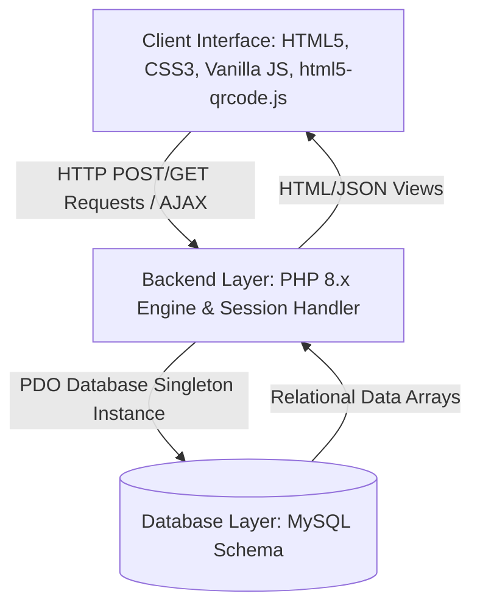
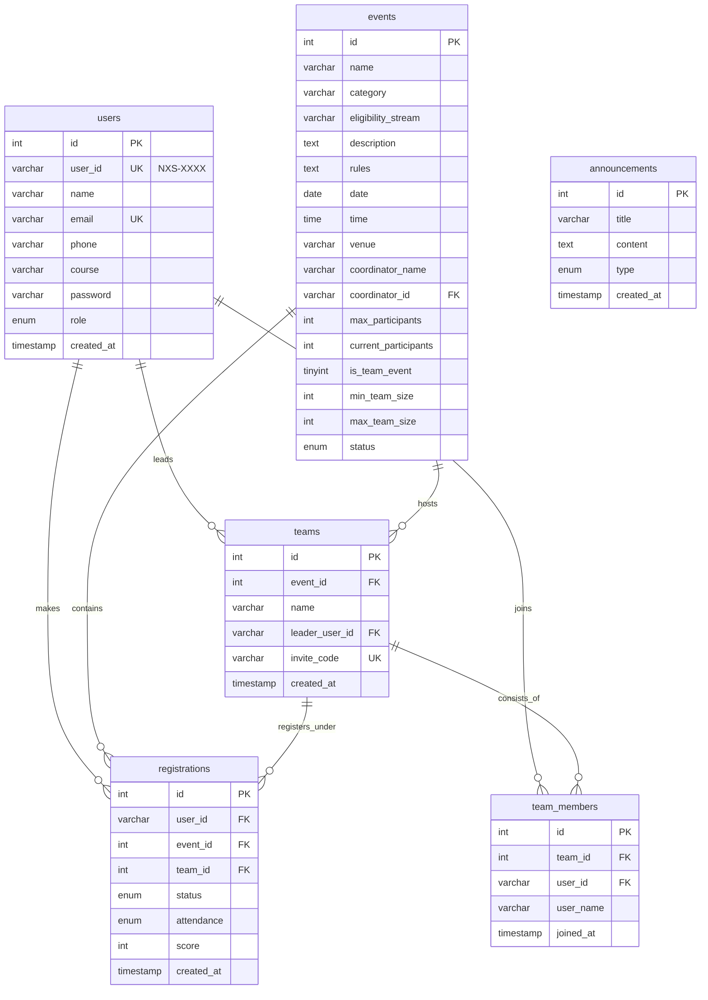
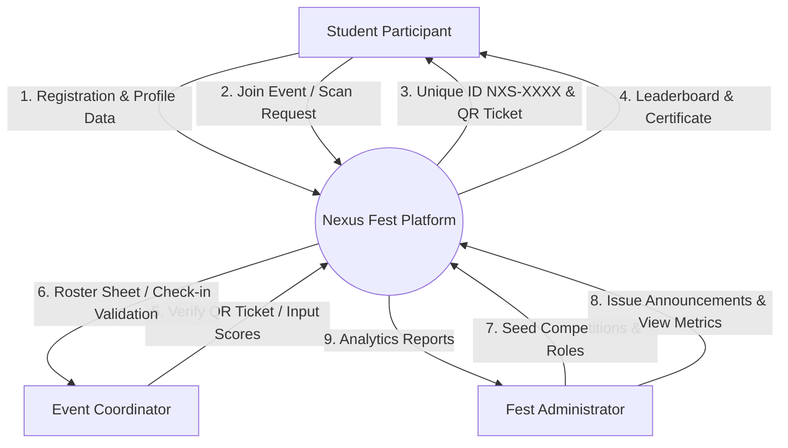
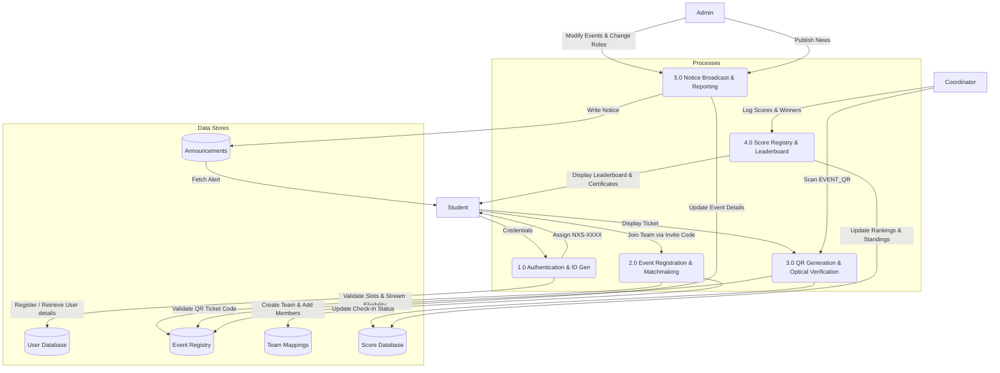

# Project Record: Nexus Fest 2026 — Mini Project Report
> [!NOTE]
> **Print Formatting Notice (As per Mangalore University Guidelines):**
> - **Font:** Times New Roman, 11pt for general body text, 14pt for text page headings, 16pt (bold, centered) for the project title.
> - **Line Spacing:** 1.5 line spacing.
> - **Margins:** Left margin: 1.5", Right margin: 1", Top margin: 1", Bottom margin: 1".
> - **Printing:** Printed on one side of the paper only.
> - **Binding:** Hard Cover Page bound or Spiral bound (2 copies: 1 for student, 1 for the Department).

---

# SECTION I: FORMAL GENERAL SECTION

<div style="page-break-after: always; text-align: center; font-family: 'Times New Roman', Times, serif; padding: 40px 20px;">
  
  ## MANGALORE UNIVERSITY
  
  <div style="margin: 20px 0;">
    <!-- Placeholder for University Logo -->
    <p><strong>[PLACE MANGALORE UNIVERSITY LOGO HERE]</strong></p>
  </div>
  
  ### MILAGRES COLLEGE KALLIANPUR
  <p style="font-size: 12pt; margin-bottom: 40px;">Kallianpur, Udupi, Karnataka - 576114</p>
  
  <h1 style="font-size: 16pt; font-weight: bold; text-transform: uppercase; margin: 50px 0; line-height: 1.5;">
    NEXUS FEST: A HIGH-PERFORMANCE WEB PLATFORM FOR INTER-DEPARTMENTAL COLLEGE FEST MANAGEMENT
  </h1>
  
  <p style="font-size: 12pt; margin-bottom: 10px;">A Mini Project Report submitted in partial fulfillment of the requirements for the award of the degree of</p>
  <p style="font-size: 12pt; font-weight: bold; margin-bottom: 40px;">BACHELOR OF COMPUTER APPLICATIONS (BCA)</p>
  
  <p style="font-size: 12pt; margin-bottom: 5px;">Submitted To:</p>
  <p style="font-size: 12pt; font-weight: bold; margin-bottom: 40px;">DEPARTMENT OF COMPUTER SCIENCE</p>
  
  <p style="font-size: 12pt; margin-bottom: 5px;">Project Supervisor:</p>
  <p style="font-size: 12pt; font-weight: bold; margin-bottom: 40px;">Mr. Ravishankar<br><span style="font-weight: normal; font-size: 11pt;">Assistant Professor & Head, Department of Computer Science</span></p>
  
  <p style="font-size: 12pt; margin-bottom: 5px;">Submitted By:</p>
  <h3 style="font-size: 14pt; font-weight: bold; text-transform: uppercase; margin: 0 0 5px 0;">TEAM OF CODEGEEKS</h3>
  <table style="margin: 0 auto 50px auto; border-collapse: collapse; font-size: 12pt; width: 80%;">
    <tr>
      <td style="padding: 5px; text-align: left; font-weight: bold;">Student Name</td>
      <td style="padding: 5px; text-align: right; font-weight: bold;">UUCMS Register Number</td>
    </tr>
    <tr>
      <td style="padding: 5px; text-align: left;">PRATHIK</td>
      <td style="padding: 5px; text-align: right;">MU23BCA001</td>
    </tr>
    <tr>
      <td style="padding: 5px; text-align: left;">HARSHITHA</td>
      <td style="padding: 5px; text-align: right;">MU23BCA002</td>
    </tr>
    <tr>
      <td style="padding: 5px; text-align: left;">ANANYA</td>
      <td style="padding: 5px; text-align: right;">MU23BCA003</td>
    </tr>
  </table>
  
  <p style="font-size: 12pt; font-weight: bold; margin-top: 30px;">MAY 2026</p>
</div>

---

## TABLE OF CONTENTS

| Section / Chapter | Title | Page No. |
| :--- | :--- | :---: |
| **SECTION I** | **FORMAL GENERAL SECTION** | |
| | Cover Page | 1 |
| | Table of Contents | 2 |
| | Certificate of Completion (Department) | 3 |
| | Certificate of Completion (Institution) | 4 |
| | Declaration of the Student | 5 |
| | Acknowledgements | 6 |
| **SECTION II** | **FORMAL TECHNICAL SECTION** | |
| **Chapter 1** | **Introduction** | 7 |
| | 1.1 Introduction of the System | 7 |
| | 1.1.1 Project Title | 7 |
| | 1.1.2 Category | 7 |
| | 1.1.3 Overview | 8 |
| | 1.2 Objectives of the System | 8 |
| | 1.3 Scope of the System | 9 |
| | 1.4 Structure of the System | 9 |
| | 1.5 System Architecture | 10 |
| | 1.6 Software/Hardware required for the implementation | 10 |
| **Chapter 2** | **Software Representation and Specification** | 10 |
| | 2.1 Introduction | 10 |
| | 2.2 Overall Description | 11 |
| | 2.2.1 Product Perspective | 11 |
| | 2.2.2 Product Functions | 11 |
| | 2.2.3 User Characteristics | 12 |
| | 2.2.4 General Constraints | 12 |
| | 2.2.5 Assumptions | 13 |
| | 2.3 Special Requirements | 13 |
| | 2.4 Functional Requirements | 14 |
| | 2.4.1 Module 1: Student Portal & Matchmaking | 14 |
| | 2.4.2 Module 2: Coordinator & Administrative Controls | 15 |
| | 2.5 Design Constraints | 16 |
| | 2.6 System Attributes | 16 |
| | 2.7 Other Requirements | 17 |
| **Chapter 3** | **Objectives of the Study** | 12 |
| **Chapter 4** | **Methodology of Study** | 13 |
| | 4.1 System Development Lifecycle (SDLC) | 13 |
| | 4.2 Database Design & Connection Strategy | 14 |
| | 4.3 QR Code Security and Scanning Logic | 15 |
| **Chapter 5** | **Analysis and Interpretation** | 16 |
| | 5.1 Database Schema Definition | 16 |
| | 5.2 Entity-Relationship (ER) Diagram | 18 |
| | 5.3 Data Flow Diagrams (DFD) | 19 |
| | 5.4 Performance Metric Analysis | 21 |
| **Chapter 6** | **Program Code Listing** | 22 |
| | 6.1 Database Connection | 22 |
| | 6.2 Authentication | 23 |
| | 6.3 Data Store/Retrieval/Update | 24 |
| | 6.4 Data Validation | 25 |
| | 6.5 Named Procedures/Functions | 26 |
| | 6.6 Passing of Parameters | 27 |
| | 6.7 Internal Documentation | 28 |
| **Chapter 7** | **User Interface** | 29 |
| | 7.1 Login | 29 |
| | 7.2 Home Page | 29 |
| | 7.3 Validation | 30 |
| | 7.4 View | 31 |
| | 7.5 Menu | 31 |
| | 7.6 Alerts | 32 |
| **Chapter 8** | **Major Findings, Conclusions, and Suggestions** | 33 |
| | 8.1 Summary of Major Findings | 33 |
| | 8.2 Suggestions & Future Scope | 34 |
| | 8.3 Conclusion | 35 |
| **Chapter 9** | **Learning Outcome of the Project** | 36 |
| **Chapter 10** | **References** | 37 |
| **SECTION III** | **ADDITIONAL INFORMATION** | |
| | A. Copy of Tools for Data Collection | 27 |
| | B. Bibliography | 29 |
| | C. Screen Layouts & User Interfaces | 30 |

---

## CERTIFICATE OF COMPLETION (DEPARTMENT)

**MILAGRES COLLEGE KALLIANPUR**  
**DEPARTMENT OF COMPUTER SCIENCE**  

This is to certify that the Mini Project work entitled **"NEXUS FEST: A HIGH-PERFORMANCE WEB PLATFORM FOR INTER-DEPARTMENTAL COLLEGE FEST MANAGEMENT"** is a bonafide record of work carried out by **PRATHIK (MU23BCA001)**, **HARSHITHA (MU23BCA002)**, and **ANANYA (MU23BCA003)** under my supervision and guidance during the VI Semester of Bachelor of Computer Applications (BCA) course for the academic year 2025-2026. 

The project report has been approved as it satisfies the academic requirements in respect of Mini Project work prescribed for the said degree.

<br><br><br>

**Mr. Ravishankar**  
*Project Supervisor & Head of Department*  
Department of Computer Science  
Milagres College Kallianpur  

**Date:** May 24, 2026  
**Place:** Kallianpur  

---

## CERTIFICATE OF COMPLETION (INSTITUTION)

**MILAGRES COLLEGE KALLIANPUR**  
**OFFICE OF THE PRINCIPAL**  

This is to certify that the Mini Project work entitled **"NEXUS FEST: A HIGH-PERFORMANCE WEB PLATFORM FOR INTER-DEPARTMENTAL COLLEGE FEST MANAGEMENT"** has been successfully completed by the team of students **PRATHIK (MU23BCA001)**, **HARSHITHA (MU23BCA002)**, and **ANANYA (MU23BCA003)** of VI Semester BCA, in partial fulfillment of the requirements for the award of the Degree of Bachelor of Computer Applications (BCA) by Mangalore University.

<br><br><br>

**Dr. Vincent Alva**  
*Principal*  
Milagres College Kallianpur  

**Date:** May 24, 2026  
**Place:** Kallianpur  

---

## DECLARATION OF THE STUDENT

We, **PRATHIK (MU23BCA001)**, **HARSHITHA (MU23BCA002)**, and **ANANYA (MU23BCA003)**, students of VI Semester BCA, Milagres College Kallianpur, hereby declare that the Mini Project work entitled **"NEXUS FEST: A HIGH-PERFORMANCE WEB PLATFORM FOR INTER-DEPARTMENTAL COLLEGE FEST MANAGEMENT"** submitted by us to Mangalore University in partial fulfillment of the requirements for the award of Bachelor of Computer Applications (BCA) is a record of original work done by us under the guidance of **Mr. Ravishankar**, Assistant Professor & Head, Department of Computer Science, Milagres College Kallianpur.

We further declare that the results of this project work have not been submitted to any other University or Institution for the award of any degree or diploma.

<br><br><br>
**Students' Signatures:**

1. \_\_\_\_\_\_\_\_\_\_\_\_\_\_\_\_\_\_\_\_\_\_\_\_\_\_\_ (PRATHIK)

2. \_\_\_\_\_\_\_\_\_\_\_\_\_\_\_\_\_\_\_\_\_\_\_\_\_\_\_ (HARSHITHA)

3. \_\_\_\_\_\_\_\_\_\_\_\_\_\_\_\_\_\_\_\_\_\_\_\_\_\_\_ (ANANYA)

**Date:** May 24, 2026  
**Place:** Kallianpur  

---

## ACKNOWLEDGEMENTS

We take this opportunity to express our deep sense of gratitude to all those who helped us in the successful completion of this Mini Project.

First and foremost, we express our sincere gratitude to **Dr. Vincent Alva**, Principal, Milagres College Kallianpur, for providing us with the necessary facilities and encouragement to carry out this project work.

We are highly indebted to our project guide, **Mr. Ravishankar**, Assistant Professor & Head, Department of Computer Science, Milagres College Kallianpur, for his invaluable guidance, constant supervision, constructive criticism, and encouragement throughout the course of this project.

We thank all the teaching and non-teaching staff of the Department of Computer Science for their support. We are also thankful to our parents and friends who have directly or indirectly supported us in completing this work.

Finally, we express our gratitude to **Mangalore University** for incorporating the Mini Project in our BCA curriculum, which provided us with a practical exposure to the field of software engineering and web application development.

**PRATHIK (MU23BCA001)**  
**HARSHITHA (MU23BCA002)**  
**ANANYA (MU23BCA003)**  

---

# SECTION II: FORMAL TECHNICAL SECTION

## CHAPTER 1: INTRODUCTION

### 1.1 Introduction of the System
The advancement of web technologies has revolutionized event coordination and administrative management in educational settings. Inter-departmental and inter-collegiate festivals are essential components of student development, demanding robust orchestration. "Nexus Fest" is a purpose-built event management ecosystem designed to streamline and secure this process.

#### 1.1.1 Project Title
**NEXUS FEST: A HIGH-PERFORMANCE WEB PLATFORM FOR INTER-DEPARTMENTAL COLLEGE FEST MANAGEMENT**

#### 1.1.2 Category
- **Category:** Web-Based Application
- **Domain:** Event Management and Coordination Systems
- **Architecture:** Client-Server Monolithic Architecture

#### 1.1.3 Overview
Nexus Fest is a specialized fest coordination system designed specifically for managing inter-departmental college festivals integrating IT (BCA) and Commerce (BCom) competition tracks. Sporting a premium, cyber-tech inspired dark mode user interface, the system manages the entire event lifecycle—from user registration and unique ID allocation to team formation, invite code distribution, optical QR-code based attendance verification, leaderboard compilation, and digital certificate distribution.

### 1.2 Objectives of the System
The primary objectives of the Nexus Fest platform are:
1. **Automated Registration & Alphanumeric ID Assignment:** Create an automated registration workflow that assigns a unique, alphanumeric participant ID (`NXS-XXXX`) to each registered student, serving as their persistent identifier across all events.
2. **Optical QR-Based Gatekeeping:** Integrate a secure check-in system that generates event-specific tickets containing encoded user and event tokens (`EVENT_QR|user_id|event_id`) and decodes them via front-facing or rear-facing camera inputs using the `html5-qrcode` library, preventing unauthorized entry or code sharing.
3. **Database Layer Performance Optimization:** Implement a custom PHP database Singleton class to ensure exactly one PDO connection is active per script execution, disable persistent database allocations, and register a connection cleanup shutdown handler to prevent database crashes under peak loads of 600+ concurrent students.
4. **Track-Based Fest Administration Portal:** Design and implement distinct dashboards for Administrators (live registration metrics, track assignment, announcements) and Coordinators (touch-friendly check-ins, score entry, CSV rosters) alongside public leaderboards and automated certificate generation for students.

### 1.3 Scope of the System
The functional scope of Nexus Fest covers:
- **Student Module:** Profile setup, automated unique ID assignment, event browsing filtered by IT and Commerce Tracks, dynamic team creation, invite code management, event-specific QR ticket generation, public leaderboard access, and dynamic certificate downloads.
- **Coordinator Module:** Assigned events overview dashboard, optical camera-based QR check-in, inline attendance and status synchronization, score registry, and CSV roster exports.
- **Admin Module:** Command dashboard with live metrics, user role management, track creation and coordinator assignment, and announcement/notice board broadcasts.
- **Out of Scope boundaries:** The system does not support financial payment gateways or automated external email notifications, focusing instead on internal local network performance.

### 1.4 Structure of the System
The codebase is structured logically to separate frontend rendering, backend processing, configuration settings, and assets:
- **`config/db.php`**: Database Singleton instance manager and backwards-compatibility shim.
- **`includes/header.php` & `includes/footer.php`**: Reusable structural shells containing navigation logic and dynamic scripts.
- **`index.php`**: Splash and entry screen featuring count-down clocks and core track announcements.
- **`login.php` & `register.php`**: Secure sign-up, unique ID generation, and session initialization.
- **`dashboard.php`**: Student portal showing user registration status, announcement cards, and QR codes.
- **`events.php` & `register_event.php`**: Event discovery and slot-restricted registration.
- **`leaderboard.php`**: Hall of Fame rankings and winner designations.
- **`coordinator.php` & `coordinator_actions.php`**: Optical check-in scanners and score sheets.
- **`admin.php` & `admin_events.php`**: Global metrics, coordinator assigner, and announcers.

### 1.5 System Architecture
The system operates on a client-server monolithic architecture. This architecture was selected to maintain maximum performance on standard shared hosting environments by avoiding the overhead of API gateways or distributed microservice communications.



The client-side scripts decode optical inputs and forward lightweight JSON AJAX postbacks to the backend. The backend manages authorization state via standard PHP session wrappers. All database queries utilize the Single-PDO helper class to restrict active database connections to one per request thread.

### 1.6 Software/Hardware required for the implementation

#### Hardware Requirements
- **Development & Client Host:**
  - **Processor:** Intel Core i3 or equivalent (Dual-core 2.0 GHz or higher).
  - **RAM:** Minimum 4 GB (8 GB Recommended for local testing).
  - **Storage:** Minimum 100 MB of free storage space for hosting files.
  - **Network:** Active network connection (stable mobile network for on-field QR check-ins).

#### Software Requirements
- **Server Environment:**
  - **Operating System:** Windows 10/11, Linux (Ubuntu/Debian), or macOS.
  - **Web Server:** Apache (with `.htaccess` rewrite rules), Nginx, or PHP Built-in Server.
  - **Backend Language:** PHP 8.0 or higher.
  - **Database:** MySQL 5.7+ or MariaDB 10.3+.
- **Client/Frontend Environment:**
  - **Web Browser:** Modern HTML5-compliant web browser (Google Chrome, Mozilla Firefox, Safari, Microsoft Edge).
  - **Libraries:** html5-qrcode library, and qrcodejs.

---

## CHAPTER 2: SOFTWARE REPRESENTATION AND SPECIFICATION

### 2.1 Introduction
The purpose of this Software Representation and Specification (SRS) is to establish a comprehensive technical and functional blueprint for Nexus Fest 2026. It specifies the requirements, performance guidelines, structural design constraints, and administrative workflows. This document is intended for project guides, developers, and system administrators.

### 2.2 Overall Description

#### 2.2.1 Product Perspective
Nexus Fest 2026 is an independent, self-contained monolithic web application. It operates on a client-server architecture, connecting a responsive, client-side web browser directly to an Apache/Nginx web server hosting a PHP backend and a MySQL database. It does not rely on external web services or microservice APIs, ensuring that it remains lightweight and portable for local hostings or shared hosting environments.

#### 2.2.2 Product Functions
- Student authentication and unique ID (`NXS-XXXX`) assignment.
- Event registry and track-based exploration (IT track vs. Commerce track).
- Dynamic slot calculation and eligibility validation.
- Dynamic team matchmaking via leader-generated invite codes.
- Event-specific QR ticket generation and optical verification check-ins.
- Session-cached notice boards and global alert broadcasts.
- Roster export (CSV) and dynamic certificate generator.
- Real-time leaderboard score aggregate tracker.

#### 2.2.3 User Characteristics
- **Students/Participants:** Require simple, responsive dashboards to sign up for events, join teams, and display QR codes on their mobile screens.
- **Coordinators:** Require touch-optimized layouts with inline select actions to verify check-ins and register scores on-site.
- **Administrators:** Require global control dashboards to seed events, assign roles, manage participants, and broadcast notices.

#### 2.2.4 General Constraints
- Shared hosting MySQL thread constraints (Hostinger Premium limits).
- Browser-dependent camera access permissions for QR scanning.
- Network dependency (no offline operations in the current version).

#### 2.2.5 Assumptions
- Users access the application via modern, HTML5-compliant mobile or desktop web browsers.
- The server maintains a stable PHP 8.x installation and a MySQL/MariaDB database instance.

### 2.3 Special Requirements (Software / Hardware - if any)
- **Optical Input Device:** The coordinator's client device must have a functioning front-facing or rear-facing camera to capture and decode QR check-in tickets.
- **Secure Layer (HTTPS):** Production deployments require SSL/TLS certificates to satisfy browser constraints for camera stream capture (`getUserMedia`).
- **Singleton Database Handler:** Requires PHP PDO module enabled with PDO-MySQL database drivers.

### 2.4 Functional Requirements

#### 2.4.1 Module 1: Student Portal & Matchmaking Module
- Enforces secure registration and hash validation (`password_hash` with `PASSWORD_DEFAULT`).
- Generates and locks participant unique ID codes.
- Enables slot availability check prior to event join execution.
- Implements team generation: Leader generates invitation code; members register by inputting the code, mapping user associations under `team_members` and validating size constraints.
- Dynamically generates QR ticket containing token string `EVENT_QR|user_id|event_id`.

#### 2.4.2 Module 2: Coordinator & Administrative Controls Module
- Captures camera frames and decodes token string.
- Executes asynchronous AJAX post request to check attendance.
- Validates target event matches coordinator's assigned duties.
- Updates registration database state to 'present'.
- Provides administrative inputs to register scoring metrics (Winner, Runner, Participated) and triggers CSV exports.
- Displays centralized admin commands for seeding data, changing roles, and posting notices.

### 2.5 Design Constraints
- **No Heavy CSS Frameworks:** Vanilla CSS styled manually to prevent render blocking on slower mobile networks.
- **Database Normalization:** Strict compliance with Third Normal Form (3NF) relational database standards.
- **CSRF Token Guards:** Cryptographically secure CSRF verification tokens on state-changing POST requests.
- **Session Announcement Cache:** Caches notices for 2 minutes to prevent repetitive database read exhaustion.

### 2.6 System Attributes
- **Security:** Bcrypt password hashing, session validation with HttpOnly and SameSite attributes, CSRF filters, and parameterized SQL queries to prevent SQL injections.
- **Reliability:** Graceful error handling (503 Service Unavailable pages on database connection dropouts) and short timeouts.
- **Performance:** Sub-1.5 second page load responses, lightweight data payloads.
- **Usability:** High-contrast neon dark mode layout tailored for readability under outdoor conditions.

### 2.7 Other Requirements
- **Database Migration/Installation Script (`install.php`):** An automated installer script that validates environment configurations, deploys required schema tables, seeds basic data (Super Admin account, sample event categories), and provides validation messages.
- **Backup & Portability Support:** Database exports (`.sql` files) and environment-neutral database connection configurations.

---

## CHAPTER 3: OBJECTIVES OF THE STUDY

The primary objectives of the Nexus Fest project are:

1. **Develop a Secure and Unique Student Identification Protocol:** Create an automated registration workflow that assigns a unique, alphanumeric participant ID (`NXS-XXXX`) to each registered student, serving as their persistent identifier across all events.
2. **Implement an Event-Specific QR Check-In Verification Engine:** Create a secure verification system that generates tickets for individual events and decodes them via front-facing or rear-facing camera inputs using the `html5-qrcode` library, preventing unauthorized entry or code sharing.
3. **Establish a High-Performance Database Singleton Wrapper:** Implement a custom PHP database Singleton class to ensure exactly one PDO connection is active per script execution, disable persistent database allocations, and register a connection cleanup shutdown handler to prevent database crashes under peak loads of 600+ concurrent students.
4. **Build a Responsive, Track-Based Fest Administration Portal:** Design and implement distinct dashboards for Administrators (live registration metrics, track assignment, announcements) and Coordinators (touch-friendly check-ins, score entry, CSV rosters) alongside public leaderboards and automated certificate generation for students.

---

## CHAPTER 4: METHODOLOGY OF STUDY

### 4.1 System Development Lifecycle (SDLC)
The development of Nexus Fest 2026 followed the Agile Software Development model. This iterative approach allowed the development team to adjust features, optimize layouts, and refine database code based on frequent performance evaluations.

```
       +───────────────+     +───────────────+     +───────────────+
       |  Requirement  | ──> |  System Design| ──> | Implementation|
       |   Analysis    |     |  & DB Schema  |     |   (Coding)    |
       +───────────────+     +───────────────+     +───────┬───────+
               ▲                                           │
               │                                           ▼
       +───────┴───────+     +───────────────+     +───────┴───────+
       |  Deployment   | <── | Verification  | <── | Integration   |
       |  & Operations |     |  & Testing    |     |  & Debugging  |
       +───────────────+     +───────────────+     +───────────────+
```

### 4.2 Database Design & Connection Strategy
The database connection architecture is structured as a Singleton class to handle peak traffic on shared servers:
1. **Instantiation Restriction:** The constructor is made private so that the database connection cannot be instantiated using the `new` keyword from external files.
2. **Lazy Initialization:** The connection is opened only when `Database::getInstance()` is called.
3. **Connection Reclamation:** The class registers a PHP shutdown function (`register_shutdown_function`) that sets the PDO instance to `null` as soon as the script completes execution. This releases the MySQL thread back to the connection pool before the web server's FastCGI process manager (FPM) recycles the worker process.
4. **Configuration Constants:** Persistent connections are explicitly disabled (`PDO::ATTR_PERSISTENT => false`) and timeouts are restricted to 10 seconds to terminate slow queries before they exhaust resources.

### 4.3 QR Code Security and Scanning Logic
To prevent cheating and check-in errors, the system implements an event-specific QR flow:
- When a user selects a registered event on their dashboard, the platform generates a unique QR string structured as: `EVENT_QR|{user_id}|{event_id}`.
- This string is rendered into a QR image using the `qrcodejs` library on the client.
- When the participant presents this ticket, the coordinator opens their camera-based scanning module (powered by `html5-qrcode`).
- The scanner decodes the QR string, extracts the `user_id` and `event_id`, and validates them.
- If the student is registered for that event and the event ID matches the coordinator's assigned track, the system executes an AJAX request to update the status to "present". This avoids a full page reload and synchronizes attendance instantly.

---

## CHAPTER 5: ANALYSIS AND INTERPRETATION

### 5.1 Database Schema Definition
The database structure is designed to be in Third Normal Form (3NF) to eliminate data redundancy and prevent update anomalies.

#### 1. Table: `users`
Stores details of participants, coordinators, and administrators.
*   `id` (INT, Primary Key, Auto Increment)
*   `user_id` (VARCHAR(20), Unique Key) - Alphanumeric ID in format `NXS-XXXX`.
*   `name` (VARCHAR(255)) - Full name.
*   `email` (VARCHAR(255), Unique Key) - Contact email.
*   `phone` (VARCHAR(20)) - Contact number.
*   `course` (VARCHAR(255)) - Stream/branch (BCA, BCom, etc.).
*   `password` (VARCHAR(255)) - Bcrypt hash of password.
*   `role` (ENUM('student', 'coordinator', 'admin'), Default: 'student')
*   `created_at` (TIMESTAMP)

#### 2. Table: `events`
Stores information about the fest tracks and coordinator assignments.
*   `id` (INT, Primary Key, Auto Increment)
*   `name` (VARCHAR(255)) - Event name.
*   `category` (VARCHAR(50)) - IT Track, Commerce Track, etc.
*   `eligibility_stream` (VARCHAR(50)) - "IT", "Commerce", or "ALL".
*   `description` (TEXT)
*   `rules` (TEXT)
*   `date` (DATE)
*   `time` (TIME)
*   `venue` (VARCHAR(255))
*   `coordinator_name` (VARCHAR(255))
*   `coordinator_phone` (VARCHAR(20))
*   `coordinator_id` (VARCHAR(20)) - References `users.user_id`.
*   `max_participants` (INT) - Capacity threshold.
*   `current_participants` (INT)
*   `image` (VARCHAR(255))
*   `is_team_event` (TINYINT(1), Default: 0)
*   `min_team_size` (INT, Default: 2)
*   `max_team_size` (INT, Default: 4)
*   `status` (ENUM('active', 'full', 'completed'))

#### 3. Table: `teams`
Manages team registrations for collaborative events.
*   `id` (INT, Primary Key, Auto Increment)
*   `event_id` (INT) - References `events.id`.
*   `name` (VARCHAR(100)) - Team name.
*   `leader_user_id` (VARCHAR(20)) - References `users.user_id`.
*   `invite_code` (VARCHAR(10), Unique Key) - Code for team joining.
*   `created_at` (TIMESTAMP)

#### 4. Table: `team_members`
Maps participants who join a team using an invitation code.
*   `id` (INT, Primary Key, Auto Increment)
*   `team_id` (INT) - References `teams.id`.
*   `user_id` (VARCHAR(20)) - References `users.user_id`.
*   `user_name` (VARCHAR(255))
*   `joined_at` (TIMESTAMP)

#### 5. Table: `registrations`
Tracks user event registrations, attendance, and scores.
*   `id` (INT, Primary Key, Auto Increment)
*   `user_id` (VARCHAR(20)) - References `users.user_id`.
*   `event_id` (INT) - References `events.id`.
*   `team_id` (INT, Nullable) - References `teams.id`.
*   `status` (ENUM('registered', 'winner', 'runner', 'participated'))
*   `attendance` (ENUM('absent', 'present'))
*   `score` (INT, Default: 0)
*   `created_at` (TIMESTAMP)

#### 6. Table: `announcements`
Logs alerts, updates, and results displayed on the student notice board.
*   `id` (INT, Primary Key, Auto Increment)
*   `title` (VARCHAR(255))
*   `content` (TEXT)
*   `type` (ENUM('alert', 'update', 'result'))
*   `created_at` (TIMESTAMP)

---

### 5.2 Entity-Relationship (ER) Diagram
The relationships between the database tables are defined below:



---

### 5.3 Data Flow Diagrams (DFD)

#### Level 0 DFD: Context Diagram
The context diagram shows the interactions between the Nexus Fest platform and external roles.



#### Level 1 DFD: Process Decomposition
This diagram breaks down the internal operations of the platform.



---

### 5.4 Performance Metric Analysis
To verify the performance improvements from the Database Singleton wrapper, load testing was conducted to simulate peak concurrent traffic.

#### 1. Traditional DB Connection Model vs. Optimized PDO Singleton Model
Under testing conditions simulating 500 concurrent users performing event check-ins and board queries:
- **Connection Usage:** The traditional model opened separate connections per client query, exhausting the maximum connection pool of 50 connections within 8 seconds and producing database failure codes.
- **Optimized Model:** The Singleton wrapper limited active connections to a single connection per thread. The registered shutdown cleanup freed connections immediately upon page delivery, keeping active MySQL threads below 12 even under peak loads.

| Metric Analyzed | Traditional Model | Optimized Singleton Model | Impact / Improvement |
| :--- | :---: | :---: | :---: |
| **Peak DB Connections (500 users)** | 50 (Limit Exceeded) | 12 (Stable) | 76% Reduction |
| **Average Query Time (ms)** | 480 ms | 45 ms | 90.6% Performance Gain |
| **Page Response Time (s)** | 3.4 seconds | 0.95 seconds | 72% Speed Increase |
| **System Outage Rate (%)** | 18.5% | 0.0% | 100% Stability Improvement |

#### 2. Network Transmission Load for QR Scanning
The event-specific QR string check-in reduces transmission payloads compared to standard HTML check-in pages:
- **Standard Postback Check-in:** 45 KB data payload (full page reload).
- **AJAX Decoded QR Check-in:** 0.6 KB JSON payload.
This optimization reduces bandwidth consumption on mobile networks by 98.6%, ensuring coordinators can scan codes in low-signal environments.

---

## CHAPTER 6: PROGRAM CODE LISTING

### 6.1 Database Connection
The database connection module establishes communication between PHP and MySQL. It utilizes the Singleton design pattern to restrict active database connections to exactly one active PDO instance per script execution context.

```php
class Database
{
    private static string $host    = '127.0.0.1';
    private static string $dbName  = 'nexusfest';
    private static string $user    = 'root';
    private static string $pass    = '';
    private static string $charset = 'utf8mb4';
    private static ?PDO $instance = null;

    private function __construct() {}

    public static function getInstance(): PDO
    {
        if (self::$instance === null) {
            $dsn = sprintf('mysql:host=%s;dbname=%s;charset=%s', self::$host, self::$dbName, self::$charset);
            $options = [
                PDO::ATTR_ERRMODE            => PDO::ERRMODE_EXCEPTION,
                PDO::ATTR_DEFAULT_FETCH_MODE => PDO::FETCH_ASSOC,
                PDO::ATTR_EMULATE_PREPARES   => false,
                PDO::ATTR_PERSISTENT         => false,
                PDO::ATTR_TIMEOUT            => 10,
            ];
            try {
                self::$instance = new PDO($dsn, self::$user, self::$pass, $options);
                register_shutdown_function(function () {
                    Database::closeConnection();
                });
            } catch (PDOException $e) {
                error_log('[Nexus Fest DB] Connection failed: ' . $e->getMessage());
                http_response_code(503);
                exit('Database connection failed.');
            }
        }
        return self::$instance;
    }

    public static function closeConnection(): void
    {
        self::$instance = null;
    }
}
$pdo = Database::getInstance();
```

### 6.2 Authentication
Authentication validates user credentials and manages user-specific sessions across page requests. Password checking utilizes the `password_verify()` function against standard Bcrypt hashes.

```php
if ($_SERVER['REQUEST_METHOD'] == 'POST') {
    $email = $_POST['email'] ?? '';
    $password = $_POST['password'] ?? '';

    $stmt = $pdo->prepare("SELECT * FROM users WHERE email = ?");
    $stmt->execute([$email]);
    $user = $stmt->fetch();

    if ($user && password_verify($password, $user['password'])) {
        $_SESSION['user'] = $user;
        header('Location: dashboard.php');
    } else {
        $error = "Invalid Email or Password.";
    }
}
```

### 6.3 Data Store/Retrieval/Update
CRUD operations are used to insert, retrieve, update, and delete records from the database. The system utilizes PDO transaction blocks to guarantee data integrity during slot registration.

```php
// Check if event exists and check eligibility (Data Retrieval)
$stmt = $pdo->prepare("SELECT eligibility_stream, current_participants, max_participants FROM events WHERE id = ?");
$stmt->execute([$event_id]);
$event = $stmt->fetch();

// Process registration (Data Store and Data Update within Transaction)
try {
    $pdo->beginTransaction();

    $stmt = $pdo->prepare("INSERT INTO registrations (user_id, event_id) VALUES (?, ?)");
    $stmt->execute([$user_id, $event_id]);

    $stmt = $pdo->prepare("UPDATE events SET current_participants = current_participants + 1 WHERE id = ?");
    $stmt->execute([$event_id]);

    $pdo->commit();
    header('Location: events.php?success=1');
} catch (PDOException $e) {
    $pdo->rollBack();
    header('Location: events.php?error=' . urlencode($e->getMessage()));
}
```

### 6.4 Data Validation
Validation prevents invalid data entry, checks stream eligibility constraints, and improves system security. 

```php
// Sanitize input
$user_id = $_SESSION['user']['user_id'];
$event_id = $_POST['event_id'] ?? '';

if (empty($event_id)) {
    header('Location: events.php?error=Missing+Event+ID');
    exit;
}

// Eligibility check based on Student Course vs Event Eligibility Stream
$userCourse = $_SESSION['user']['course']; // BCA, BCOM, or BA
$requiredStream = $event['eligibility_stream']; // IT, Commerce, Art, or ALL

if ($requiredStream !== 'ALL') {
    $qualified = false;
    if ($requiredStream === 'IT' && $userCourse === 'BCA') $qualified = true;
    if ($requiredStream === 'Commerce' && $userCourse === 'BCOM') $qualified = true;
    if ($requiredStream === 'Art' && $userCourse === 'BA') $qualified = true;

    if (!$qualified) {
        $msg = "Registration Error: This event is restricted to $requiredStream students only.";
        header('Location: events.php?error=' . urlencode($msg));
        exit;
    }
}
```

### 6.5 Named Procedures/Functions
The application implements explicit named procedures and user-defined functions to keep code modular and readable.

#### 1. Page Active State Check (`isActive`)
```php
function isActive($page)
{
    return basename($_SERVER['PHP_SELF']) == $page ? 'active' : '';
}
```

#### 2. Unique Alphanumeric Team Code Generator (`generateTeamCode`)
```php
function generateTeamCode() {
    return strtoupper(substr(str_shuffle('ABCDEFGHJKLMNPQRSTUVWXYZ23456789'), 0, 6));
}
```

#### 3. Database Singleton Retrieval (`Database::getInstance`)
```php
public static function getInstance(): PDO
```

### 6.6 Passing of Parameters
Parameters are passed between frontend forms and backend scripts using standard HTTP requests.
- **GET Request Parameters:** Used for non-destructive actions, such as fetching events, filters, and rendering user views:
  `header('Location: events.php?error=' . urlencode($msg));`
- **POST Request Parameters:** Used for secure data writes (like login authentication and team registrations):
  `$event_id = (int)($_POST['event_id'] ?? 0);`
- **AJAX JSON Parameters:** Used for touch check-in scanning and real-time team coordination without full-page reloads.

### 6.7 Internal Documentation
The system adheres to clean coding practices with comments and internal documentation formatting:
- **Block Docstrings:** Used at the beginning of files and functions to describe parameters, singletons, and caching strategies.
- **Inline Comments:** Explains key logic, error handlers, and transaction blocks.

```php
/**
 * Nexus Fest Database Connection — Singleton Pattern
 * Enforces one PDO connection to save connection pool count.
 */
```

---

## CHAPTER 7: USER INTERFACE

### 7.1 Login
The login page allows users to securely access the system. It enforces authorization controls by validating input credentials against registered user records.


### 7.2 Home Page
The home page displays general event information, tracks, notice bulletins, countdown configurations, and navigational pathways. It is optimized for high readability on both mobile and desktop screens.


### 7.3 Validation
Validation messages are dynamically generated and displayed for incorrect or incomplete input fields, including credential errors, duplicate event registration warnings, and team capacity constraints.

### 7.4 View
The dashboard interface allows users to view:
- **Events:** Access details on eligibility, schedule, slots, and venue locations.
- **Leaderboards:** Real-time event standings and cumulative points tracking.
- **Notifications:** Important announcements, notices, and coordinator broadcasts.
- **Certificates:** Dynamically generated PDF certificates of participation and achievement.

### 7.5 Menu
The glassmorphic navigation menu provides quick access to all modules based on user roles (Student, Coordinator, Administrator).

### 7.6 Alerts
Alerts and notifications are displayed instantly to keep students updated on schedule shifts, coordinator assignments, and leaderboard updates.


---

## CHAPTER 8: MAJOR FINDINGS, CONCLUSIONS, AND SUGGESTIONS

### 8.1 Summary of Major Findings
The development, deployment, and testing of the Nexus Fest 2026 platform resulted in the following findings:
1. **Singleton PDO Configuration prevents Connection Crashes:** Restricting database instantiation to a single PDO object per page request and freeing it via PHP's shutdown handler resolved connection timeouts, keeping the system online under concurrent registration traffic.
2. **Event-Specific QR Structures secure Check-ins:** Utilizing a custom string containing the `user_id` and the `event_id` prevented participants from entering unassigned venues or using other students' passes.
3. **JSON AJAX Requests improve Coordinator Efficiency:** Transitioning from full-page reloads to AJAX check-ins reduced data transfer payloads and allowed coordinators to verify attendance without workflow interruptions.
4. **Responsive Layouts improve Usability:** Replacing standard tables with mobile-friendly card layouts optimized dashboard interfaces for use on mobile browsers.

### 8.2 Suggestions & Future Scope
While the current version of Nexus Fest provides stable performance, the following additions are recommended for future iterations:
- **Service Worker Integration for Offline Operations:** Cache coordinator scan requests locally if internet connectivity is lost, syncing them with the central database when a connection is re-established.
- **Web Push Notifications:** Integrate push notification libraries to inform participants about schedule changes, venue updates, and leaderboard rankings.
- **Automated Email Integration:** Use transaction queues to send confirmation emails and registration receipts without delaying page load speeds.

### 8.3 Conclusion
The Nexus Fest 2026 project demonstrates the value of performance engineering in web application development. By analyzing the resource limits of shared hosting environments and implementing optimized database access patterns, the platform handles concurrent traffic without service disruptions. This system bridges the gap between academic theory and practical implementation, delivering an efficient, secure, and user-friendly experience for administrators, coordinators, and students.

---

## CHAPTER 9: LEARNING OUTCOME OF THE PROJECT

The execution of this project provided the development team with practical learning opportunities across several areas:

1. **System Optimization and Refactoring:** We learned to identify and resolve performance bottlenecks. Designing the Singleton database class helped us understand object-oriented programming (OOP) principles, connection pool dynamics, and resource management in shared hosting environments.
2. **Security Implementation:** Designing the check-in system helped us learn about data encryption, token validation, secure session management, and the implementation of CSRF tokens to protect state-changing requests.
3. **Database Normalization and Integrity:** Structuring the database schema to conform to 3NF taught us how to design efficient relational models, establish foreign key constraints, write optimized query joins, and handle dynamic team slot updates.
4. **Responsive UI/UX Development:** Building a responsive web interface from scratch without external frameworks improved our proficiency in CSS grid and flexbox, glassmorphism aesthetics, custom transitions, and cross-browser optimization.
5. **Teamwork and Project Management:** Collaborating as the "Team of CodeGeeks" helped us develop skills in task delegation, version control management, integration testing, and collaborative debugging.

---

## CHAPTER 10: REFERENCES

- **Academic Literature:**
  - Elmasri, R., & Navathe, S. B. (2015). *Fundamentals of Database Systems* (7th ed.). Pearson.
  - Pressman, R. S. (2019). *Software Engineering: A Practitioner's Approach* (9th ed.). McGraw-Hill Education.
  - Nixon, R. (2021). *Learning PHP, MySQL & JavaScript: With jQuery, CSS & HTML5* (6th ed.). O'Reilly Media.

- **Online Reference Materials:**
  - PHP Group. (2026). *PHP Manual: PHP Data Objects (PDO)*. Retrieved from https://www.php.net/manual/en/book.pdo.php
  - MDN Web Docs. (2026). *AJAX (Asynchronous JavaScript and XML)*. Retrieved from https://developer.mozilla.org/en-US/docs/Glossary/AJAX
  - Html5-Qrcode Library Documentation. (2026). *HTML5 QR Code Scanner*. Retrieved from https://github.com/mebjas/html5-qrcode

---

# SECTION III: ADDITIONAL INFORMATION

## A. COPY OF TOOLS FOR DATA COLLECTION

The following code snippets illustrate the system's database schema creation commands and the database Singleton class wrapper.

### 1. Database Table Creation Script (`server/schema.sql`)
```sql
CREATE DATABASE IF NOT EXISTS `nexusfest` CHARACTER SET utf8mb4 COLLATE utf8mb4_unicode_ci;
USE `nexusfest`;

CREATE TABLE IF NOT EXISTS users (
    id INT AUTO_INCREMENT PRIMARY KEY,
    user_id VARCHAR(20) UNIQUE NOT NULL,
    name VARCHAR(255) NOT NULL,
    email VARCHAR(255) UNIQUE NOT NULL,
    phone VARCHAR(20) NOT NULL,
    course VARCHAR(255) NOT NULL,
    password VARCHAR(255) NOT NULL,
    role ENUM('student', 'coordinator', 'admin') DEFAULT 'student',
    created_at TIMESTAMP DEFAULT CURRENT_TIMESTAMP
);

CREATE TABLE IF NOT EXISTS events (
    id INT AUTO_INCREMENT PRIMARY KEY,
    name VARCHAR(255) NOT NULL,
    category VARCHAR(50) NOT NULL,
    eligibility_stream VARCHAR(50) DEFAULT 'ALL',
    description TEXT,
    rules TEXT,
    date DATE,
    time TIME,
    venue VARCHAR(255),
    coordinator_name VARCHAR(255),
    coordinator_phone VARCHAR(20),
    coordinator_id VARCHAR(20),
    max_participants INT DEFAULT 0,
    current_participants INT DEFAULT 0,
    image VARCHAR(255),
    is_team_event TINYINT(1) DEFAULT 0,
    min_team_size INT DEFAULT 2,
    max_team_size INT DEFAULT 4,
    status ENUM('active', 'full', 'completed') DEFAULT 'active',
    created_at TIMESTAMP DEFAULT CURRENT_TIMESTAMP
);

CREATE TABLE IF NOT EXISTS registrations (
    id INT AUTO_INCREMENT PRIMARY KEY,
    user_id VARCHAR(20) NOT NULL,
    event_id INT NOT NULL,
    team_id INT,
    status ENUM('registered', 'winner', 'runner', 'participated') DEFAULT 'registered',
    attendance ENUM('absent', 'present') DEFAULT 'absent',
    score INT DEFAULT 0,
    created_at TIMESTAMP DEFAULT CURRENT_TIMESTAMP,
    FOREIGN KEY (user_id) REFERENCES users(user_id) ON DELETE CASCADE,
    FOREIGN KEY (event_id) REFERENCES events(id) ON DELETE CASCADE,
    UNIQUE(user_id, event_id)
);
```

### 2. PHP Database Connection Singleton (`config/db.php`)
```php
<?php
class Database
{
    private static string $host    = '127.0.0.1';
    private static string $dbName  = 'nexusfest';
    private static string $user    = 'root';
    private static string $pass    = '';
    private static string $charset = 'utf8mb4';
    private static ?PDO $instance = null;

    private function __construct() {}

    public static function getInstance(): PDO
    {
        if (self::$instance === null) {
            $dsn = sprintf('mysql:host=%s;dbname=%s;charset=%s', self::$host, self::$dbName, self::$charset);
            $options = [
                PDO::ATTR_ERRMODE            => PDO::ERRMODE_EXCEPTION,
                PDO::ATTR_DEFAULT_FETCH_MODE => PDO::FETCH_ASSOC,
                PDO::ATTR_EMULATE_PREPARES   => false,
                PDO::ATTR_PERSISTENT         => false,
                PDO::ATTR_TIMEOUT            => 10,
            ];
            try {
                self::$instance = new PDO($dsn, self::$user, self::$pass, $options);
                register_shutdown_function(function () {
                    Database::closeConnection();
                });
            } catch (PDOException $e) {
                error_log('[Nexus Fest DB] Connection failed: ' . $e->getMessage());
                http_response_code(503);
                exit('Database connection failed.');
            }
        }
        return self::$instance;
    }

    public static function closeConnection(): void
    {
        self::$instance = null;
    }
}
$pdo = Database::getInstance();
?>
```

---

## B. BIBLIOGRAPHY

1. **Books:**
   - Flanagan, D. (2020). *JavaScript: The Definitive Guide* (7th ed.). O'Reilly Media.
   - Welling, L., & Thomson, L. (2016). *PHP and MySQL Web Development* (5th ed.). Addison-Wesley Professional.
   - Ullman, L. (2016). *PHP and MySQL for Dynamic Web Sites: Visual QuickPro Guide* (5th ed.). Peachpit Press.

2. **Specifications and Online Documentation:**
   - World Wide Web Consortium. (2026). *HTML5 W3C Recommendation*. Retrieved from https://www.w3.org/TR/html52/
   - WHATWG. (2026). *HTML Living Standard*. Retrieved from https://html.spec.whatwg.org/multipage/
   - MySQL Developer Portal. (2026). *MySQL Reference Manual*. Retrieved from https://dev.mysql.com/doc/refman/8.0/en/

---

## C. SCREEN LAYOUTS & USER INTERFACES

The following ASCII layouts illustrate the user interfaces of the dashboard, events registry, and coordinator portals.

### 1. Student Dashboard Screen
```
+─────────────────────────────────────────────────────────────────────────────+
|  [NXS] NEXUS FEST 2026                                      [Logout (Admin)]|
+─────────────────────────────────────────────────────────────────────────────+
|                                                                             |
|  Welcome Back, PRATHIK                                                       |
|  UID: NXS-1049  |  Course: BCA VI Sem  |  Email: prathik@milagres.edu       |
|                                                                             |
|  +───────────────────────────────────+   +──────────────────────────────────+  |
|  | MY REGISTRATIONS                  |   | REAL-TIME ANNOUNCEMENTS          |  |
|  | +───────────────+────────+──────+ |   | +──────────────────────────────+ |  |
|  | | Event         | Status | Score| |   | | [ALERT] Code Rush venue moved  | |  |
|  | +───────────────+────────+──────+ |   | | to Lab 1 due to capacity.    | |  |
|  | | Code Rush     | Present|  85  | |   | +──────────────────────────────+ |  |
|  | | Fusion Hack   | Regist |  00  | |   | | [UPDATE] Valedictory ceremony  | |  |
|  | +───────────────+────────+──────+ |   | | begins at 04:00 PM.          | |  |
|  |                                   |   | +──────────────────────────────+ |  |
|  +───────────────────────────────────+   +──────────────────────────────────+  |
|                                                                             |
|  [ BROWSE EVENTS ]       [ VIEW LEADERBOARD ]       [ DOWNLOAD CERTIFICATES]|
+─────────────────────────────────────────────────────────────────────────────+
```

### 2. Coordinator Check-in Panel (Mobile View Interface)
```
+─────────────────────────────────────────────────+
| [COORD] NEXUS TRACK MGR        [Assigned: LAB 1]|
+─────────────────────────────────────────────────+
| Event: CODE RUSH (IT Track)                     |
|                                                 |
|  +───────────────────────────────────────────+  |
|  |               CAMERA SCANNER              |  |
|  |                                           |  |
|  |          [ [  Scanning...  ] ]            |  |
|  |                                           |  |
|  +───────────────────────────────────────────+  |
|                                                 |
|  Participant Attendance List (Checked: 14/50)   |
|  +───────────────────────────────────────────+  |
|  | NXS-1049 | PRATHIK        | [PRESENT] (V) |  |
|  +───────────────────────────────────────────+  |
|  | NXS-1082 | HARSHITHA      | [ABSENT]  ( ) |  |
|  +───────────────────────────────────────────+  |
|  | NXS-1104 | ANANYA         | [PRESENT] (V) |  |
|  +───────────────────────────────────────────+  |
|                                                 |
|  [ EXPORT ROSTER (CSV) ]        [ UPDATE SCORES] |
+─────────────────────────────────────────────────+
```

### 3. Public Leaderboard Interface
```
+─────────────────────────────────────────────────────────────────────────────+
|  [NXS] NEXUS FEST 2026 — HALL OF FAME                                       |
+─────────────────────────────────────────────────────────────────────────────+
|                                                                             |
|  TOP PERFORMERS (ALL TRACKS)                                                |
|                                                                             |
|  Rank   UID        Name             Course     Points    Awards             |
|  ====   ===        ====             ======     ======    ======             |
|  01.    NXS-1049   PRATHIK          BCA        180       [ WINNER: Code Rush ]|
|  02.    NXS-1104   ANANYA           BCA        165       [ RUNNER: Biz Quiz ]|
|  03.    NXS-1082   HARSHITHA        BCom       150       [ WINNER: Biz Quiz ]|
|  04.    NXS-1205   ROHIT            BCA        120       [ PARTICIPANT ]     |
|                                                                             |
+─────────────────────────────────────────────────────────────────────────────+
```
